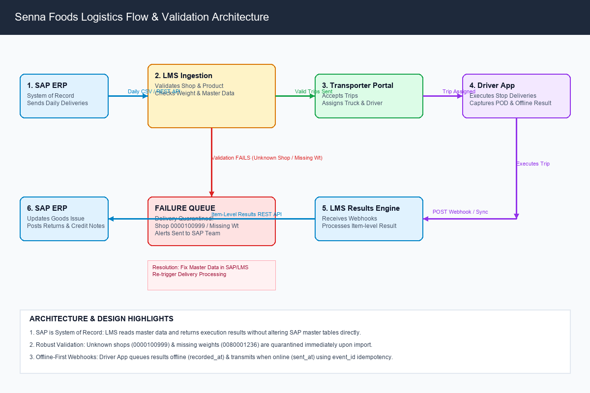

# Senna Foods — Logistics Flow Assignment



## Overview

Senna Foods manufactures and sells food products to retail stores across India. Billed orders are generated daily in SAP ERP. Previously, logistics execution was tracked manually using Excel spreadsheets and informal WhatsApp messages. This lack of automated integration created data mismatches between SAP and field execution regarding actual item deliveries, damaged returns, and billing adjustments.

This repository presents the complete implementation design for introducing an automated **Logistics Management System (LMS)** to bridge SAP ERP, logistics transport partners, and drivers.

---

## Business Flow

```
[ SAP ERP ] ──► [ LMS Engine ] ──► [ Transport Company Portal ] ──► [ Driver Partner App ] ──► [ LMS Engine ] ──► [ SAP ERP ]
```

1. **SAP ERP → LMS Engine:** SAP exports daily delivery orders to LMS (**Current:** Daily CSV file exchange | **Target:** Automated REST API).
2. **LMS Engine:** Validates master data (shops, products, gross weights) and optimizes trip routes.
3. **Transport Company Portal:** Logistics partners accept trips and assign trucks and drivers.
4. **Driver Partner App:** Mobile app for drivers to execute stops, capture signatures, and record POD photos (**Offline-First**).
5. **Driver App → LMS Engine:** Real-time event updates pushed via **HTTPS Webhooks** (authenticated via `X-Signature`).
6. **LMS Engine → SAP ERP:** Item-level execution results and return reasons posted back to SAP via **REST API**.

---

## What I Worked On

* **Data Mapping:** Mapped 11 core SAP fields (`VBELN`, `POSNR`, `KUNNR`, `NAME1`, `ORT01`, `PSTLZ`, `MATNR`, `ARKTX`, `LFIMG`, `VRKME`, `BRGEW`) to LMS target fields, enforcing unit conversions (`CS` ➔ `CASE`) and leading zero formatting rules.
* **Integration Hand-offs:** Formatted system transfer specifications across all 6 logistics pipeline stages.
* **Delivery Result & Status Design:** Designed the trip state machine (`Planned` ➔ `Sent to Transporter` ➔ `Assigned` ➔ `Started` ➔ `Completed`) and delivery result schemas.
* **REST API Specifications:** Designed lightweight REST endpoints for onboarding 7 master entities (`Shops`, `Locations`, `Zones`, `Truck Types`, `Transporters`, `Freight Rates`, `Products`).
* **Webhook Specifications:** Designed mobile event webhooks (`trip.started`, `stop.result_saved`, `trip.completed`) with `X-Signature` header verification.
* **Failure Handling:** Designed robust validation gates and quarantine workflows for missing weights, unknown shop codes, duplicate webhooks, and LMS downtime.
* **Testing:** Authored 6 Given/When/Then test cases (including success, partial delivery, returns, missing weight failure, unknown shop failure, and duplicate event deduplication).
* **Python Validation Script:** Built a Python script (`bonus/process_deliveries.py`) to parse daily SAP delivery CSV files, group items by delivery number (`VBELN`), compute payload weights, and log errors without crashing.

---

## Key Failure Scenarios

| Scenario | System Behavior & Resolution |
| :--- | :--- |
| **Missing Gross Weight (`BRGEW`)** | Validation flags Delivery `0080001236`. Delivery **does not proceed to trip planning**. It is quarantined in the Error Queue until weight data is updated in SAP. |
| **Unknown Shop Code (`0000100999`)** | Validation flags Delivery `0080001237` (Om Provisions). LMS **does not auto-create unverified shops**. Delivery is quarantined in Error Queue and an alert is sent to the SAP team. |
| **Duplicate Webhook Packet** | LMS reads `event_id` from payload. If `event_id` was already processed, LMS skips business actions and returns HTTP 200 OK so the mobile app stops retrying. |
| **LMS Engine Downtime** | Driver Partner App stores recorded results locally on phone and retries transmission with exponential backoff delays until LMS is reachable. |
| **Offline Driver Synchronization** | Mobile app captures exact local entry time in `recorded_at` (offline) and server transmission time in `sent_at` (online) to guarantee accurate SLA tracking. |

---

## Bonus Python Script

The script `bonus/process_deliveries.py`:
* Reads `data/SAP_delivery_sample.csv` using Python's standard `csv` library.
* Groups line items by delivery number (`VBELN`).
* Calculates total item counts and gross payload weight.
* Identifies missing weight (Delivery `0080001236`) and unknown shop (Delivery `0080001237` / Shop `0000100999`).
* Displays all deliveries in the summary report (marking unregistered shops cleanly) and prints `VALIDATION WARNINGS` and `CRITICAL ERRORS` without crashing.

---

## Project Structure

```
senna-foods-logistics-assignment/
├── README.md                                             # Portfolio project overview
├── Anandha_Raaman_Senna_Foods_Logistics_Assignment.pdf   # Complete submission PDF document
├── task1_data_mapping.md                                 # Task 1: Data mapping & hand-offs
├── task2_results_to_sap.md                               # Task 2: Trip status & result schema
├── task3_apis_webhooks.md                                # Task 3: REST APIs, webhooks & security
├── INTERVIEW_PREPARATION.md                              # 30-minute review call prep guide
├── client_email.md                                       # Client email to SAP team (<150 words)
│
├── bonus/
│   ├── process_deliveries.py                             # Python CSV grouping & validation script
│   └── sample_output.txt                                 # Execution output generated by script
│
├── data/
│   ├── SAP_delivery_sample.csv                           # Sample SAP delivery input dataset
│   └── LMS_data_fields.csv                               # LMS data field target specification
│
└── docs/
    └── logistics_flow.png                                # Architecture & validation diagram
```

---

## Important Design Decisions

1. **SAP Remains System of Record:** LMS reads master data and returns item-level execution results without directly altering SAP master tables.
2. **Item-Level Delivery Results:** Execution results are reported per item (SKU) to enable SAP to process partial credit notes and stock adjustments for specific returned/damaged goods.
3. **`event_id` Idempotency:** Webhook events carry a unique `event_id` to prevent duplicate processing during network retries.
4. **`X-Signature` Security:** Webhooks include an `X-Signature` HTTP header to verify request authenticity and prevent payload tampering.
5. **`recorded_at` vs. `sent_at`:** Differentiates driver local entry timestamp (`recorded_at`) from server receipt timestamp (`sent_at`) for offline execution accuracy.

---

## Note

> **Assignment Disclaimer:** This repository represents an implementation engineering assignment, system architecture design, and Python verification exercise. Advanced infrastructure patterns (such as RabbitMQ/SQS message queues, CDC pipelines, or cloud clusters) are documented as future production recommendations beyond the scope of this assignment.
